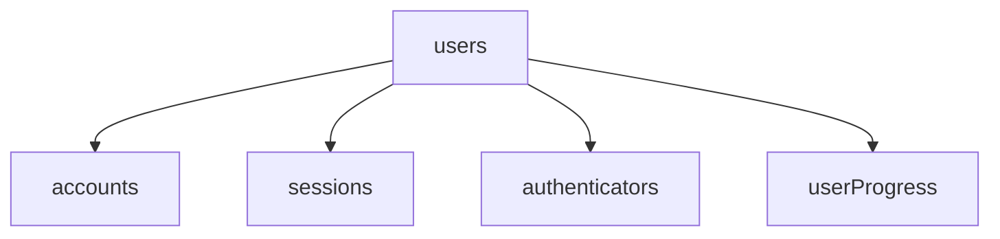
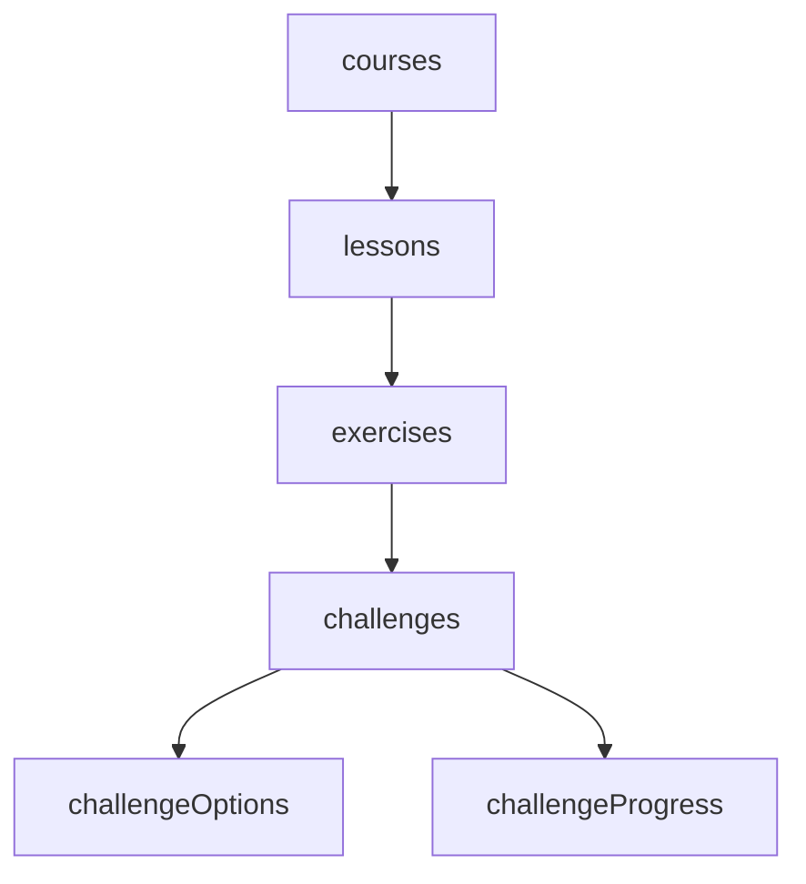

# Architecture Documentation

## System Overview

Misqui is an interactive educational platform built with a modern tech stack focusing on scalability, maintainability, and user experience. The application follows a modular architecture with clear separation of concerns.

## Tech Stack

### Frontend

- **Framework**: Next.js 15 with React 19
- **State Management**: Zustand
- **UI Components**:
  - Tailwind CSS v4 with shadcn/ui
  - Radix UI primitives
  - Custom components for educational content

### Backend

- **Runtime**: Node.js with Next.js API routes
- **Database**: Neon PostgreSQL
- **ORM**: Drizzle ORM
- **Authentication**: AuthJS v5

### Infrastructure

- **Hosting**: Vercel
- **Database**: Neon PostgreSQL
- **CDN**: Vercel Edge Network
- **Monitoring**: custom logger for logging

## Database Architecture

### Core Schema

#### Users and Authentication

#### Course Structure

### Key Tables

1. **Courses**

   - Primary educational content container
   - Contains title, description, and metadata
   - One-to-many relationship with lessons

2. **Lessons**

   - Logical grouping of exercises
   - Ordered sequence within a course
   - Contains title and description

3. **Exercises**

   - Individual learning modules
   - Ordered sequence within lessons
   - Contains challenges and learning content

4. **Challenges**

   - Interactive learning exercises
   - Multiple types (SELECT, ASSIST)
   - Contains questions and options

5. **Challenge Options**

   - Possible answers for challenges
   - Supports text, image, and audio
   - Marked as correct/incorrect

6. **User Progress**
   - Tracks user completion status
   - Stores points and achievements
   - Maintains learning streaks

## Application Flow

### Authentication Flow

1. User authentication via AuthJS
2. Session management with secure tokens
3. Role-based access control
4. Multi-factor authentication support

### Learning Flow

1. Course selection and enrollment
2. Lesson and exercise progression
3. Challenge completion tracking
4. Progress and achievement updates

### Data Flow

1. User interactions → API routes
2. API routes → Database queries
3. Database → State management
4. State → UI updates

## State Management

### Global State

- User authentication status
- Current course progress
- UI preferences
- System notifications

### Local State

- Current exercise context
- Challenge responses
- Temporary user inputs
- UI component states

## API Structure

### RESTful Endpoints

- `/api/auth/*` - Authentication routes
- `/api/courses/*` - Course management
- `/api/progress/*` - User progress tracking
- `/api/challenges/*` - Challenge interactions

### WebSocket Endpoints

- Real-time progress updates
- Live challenge feedback
- Multiplayer game states

## Security Architecture

### Authentication

- JWT-based authentication
- Secure session management
- Role-based access control
- Rate limiting

### Data Protection

- Input validation
- SQL injection prevention
- XSS protection
- CSRF protection

## Performance Considerations

### Caching Strategy

- Redis for session data
- CDN for static assets
- Database query caching
- API response caching

### Optimization Techniques

- Code splitting
- Lazy loading
- Image optimization
- Database indexing

## Deployment Architecture

### Production Environment

- Vercel for hosting
- Neon for database
- Edge network for CDN
- Automated deployments

### Development Environment

- Local development server
- Development database
- Hot reloading
- Debug tools

## Monitoring and Logging

### Logging Strategy

- Custom logger for application logs
- Error tracking
- Performance monitoring
- User activity tracking

### Metrics

- Response times
- Error rates
- User engagement
- System health

## Future Considerations

### Scalability

- Horizontal scaling
- Database sharding
- Load balancing
- Microservices architecture

### Feature Roadmap

- Advanced analytics
- AI-powered learning
- Social features
- Mobile applications

## Development Guidelines

### Code Organization

- Feature-based structure
- Clear separation of concerns
- Consistent naming conventions
- Modular components

### Testing Strategy

- Lesson tests
- Integration tests
- E2E tests
- Performance tests

### Documentation

- Code comments
- API documentation
- Architecture diagrams
- Deployment guides
